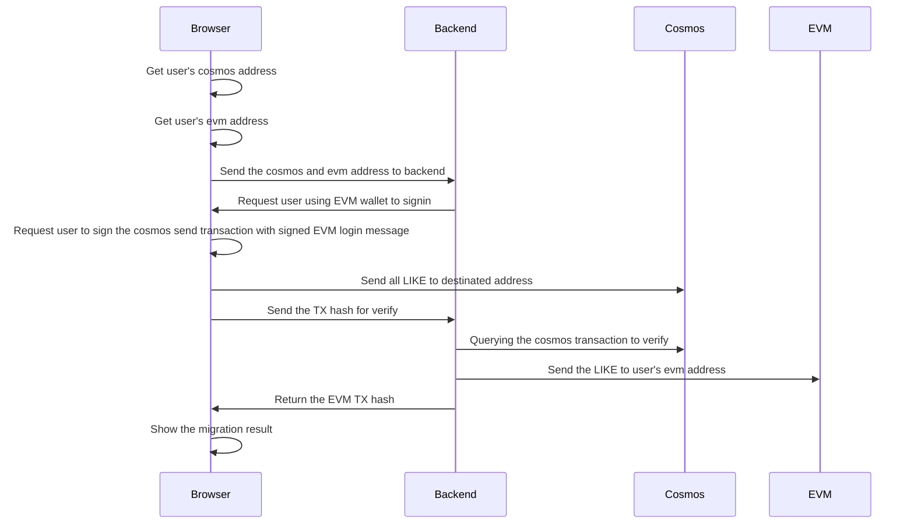

# Likecoin Migration

This repo contains the code for the migration program, from cosmos like to evm likecoin.

## Program flow



Note:

- The migration program will paid for the gas fee of the evm transaction.
- The destinated address of migrated LIKE will be redelegate across the validator for protecting the security of the chain.

## Pre-requisite

Node 20

## Dev

```bash
$ make setup
```

```bash
$ make dev
```
