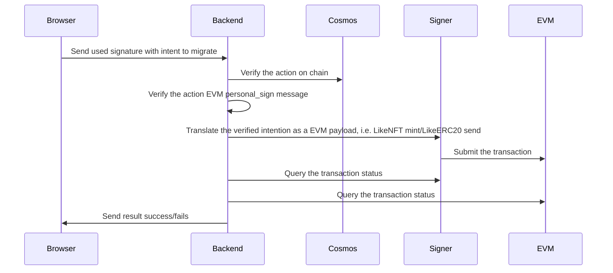

# LikeCoin Migration Backend

## Program flow



## Note

- The migration program will paid for the gas fee of the evm transaction.
- Backend will hold the logic while have no ability to sign the transaction. It's for segregration of duty.
- Signer will
    - Hold the hot wallet
    - Sign submitted transaction
    - Detect low balance
    - Detect any anomaly of the transaction

## Project setup

```sh
$ make secrets
$ make vendor
```

## Infra

```sh
$ docker compose up
```

## Migration

```sh
$ make run-migration
```

## Dev

```sh
$ make start
```

## Create migration

```sh
$ make create-migration
```
